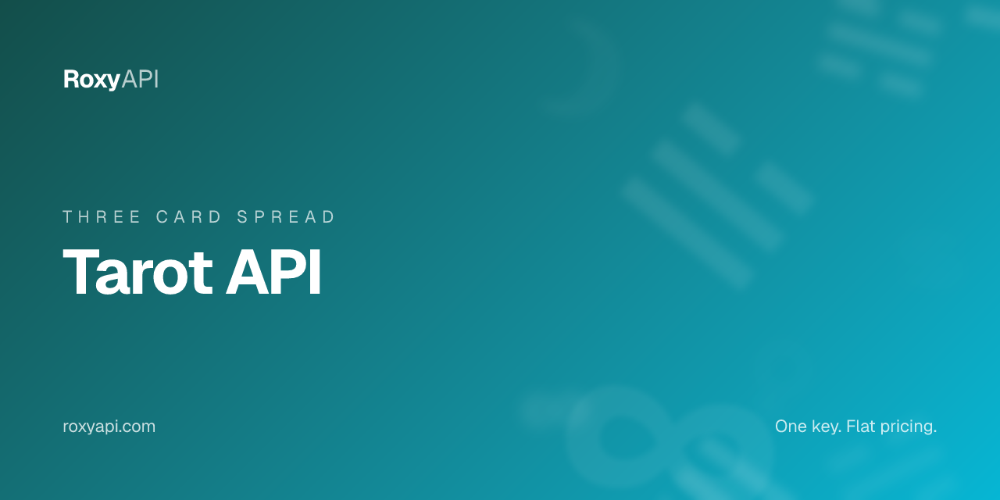

[](https://roxyapi.com/products/tarot-api)

# Tarot API

> Three-card past, present, future. Celtic Cross, yes no, love spread, daily card. Seeded RNG over the curated 78-card deck for deterministic per-user readings. One key covers 10 spiritual domains. MCP-first, no local setup required.

[](https://roxyapi.com/pricing)
[](https://roxyapi.com/api-reference)
[](https://roxyapi.com/methodology)
[](https://roxyapi.com/docs/mcp)
[](https://roxyapi.com/docs/sdk)

## What is Tarot API

The RoxyAPI tarot endpoint ships the full 78-card Rider-Waite-Smith deck (22 Major Arcana plus 56 Minor Arcana) with upright and reversed meanings, position-specific interpretations, keyword arrays, and CDN-hosted card artwork. The three-card spread returns Past, Present, and Future positions in one call. Draws use a seedable RNG so the same seed always returns the same cards in the same positions, which makes daily-card features and shareable readings trivial. One RoxyAPI subscription covers 10 spiritual domains: tarot, Western astrology, Vedic astrology, numerology, biorhythm, I Ching, crystals, dreams, and angel numbers. This repo ships working TypeScript, JavaScript, and Python samples so you can drop tarot reading features into a divination, dating, or wellness product in minutes.

## Why this API

| Property | Value |
|----------|-------|
| Coverage | 10 spiritual domains in one subscription |
| Calculation | Seedable RNG over the curated 78-card deck |
| Spreads | Three-Card, Celtic Cross, Love, Career, Yes No, Daily, plus custom builder |
| MCP server | `https://roxyapi.com/mcp/tarot` (Streamable HTTP, no local setup) |
| SDKs | TypeScript on npm `@roxyapi/sdk`, Python on PyPI `roxy-sdk` |
| Pricing | One key, flat per call, $39 for 25K calls |
| Licensing | No AGPL or GPL entanglement |
| Last verified | 2026-Q2 |

## Quick start

1. Get a key at [roxyapi.com/pricing](https://roxyapi.com/pricing)
2. Pick a language below
3. Copy the snippet, run, ship

### cURL

```bash
curl -X POST https://roxyapi.com/api/v2/tarot/spreads/three-card \
  -H "X-API-Key: $ROXY_API_KEY" \
  -H "Content-Type: application/json" \
  -d '{"question":"What do I need to know about my career?","seed":"sample-user-2026"}'
```

### Python

```python
import os
from roxy_sdk import create_roxy

roxy = create_roxy(os.environ["ROXY_API_KEY"])

# Three-card past, present, future. Same seed reproduces identical cards in identical positions.
reading = roxy.tarot.cast_three_card(
    question="What do I need to know about my career?",
    seed="sample-user-2026",
)

print(reading["spread"])                              # Three-Card
for pos in reading["positions"]:
    card = pos["card"]
    print(pos["name"], card["name"], "reversed" if card["reversed"] else "upright")
    print("  keywords:", card["keywords"])
print(reading["summary"])
```

### JavaScript (Node)

```js
import { createRoxy } from '@roxyapi/sdk';

const roxy = createRoxy(process.env.ROXY_API_KEY);

// Three-card spread: Past, Present, Future. Stickiest beginner reading on tarot apps.
const { data, error } = await roxy.tarot.castThreeCard({
  body: { question: 'What do I need to know about my career?', seed: 'sample-user-2026' },
});

if (error) throw new Error(error.error);

console.log('Spread:', data.spread);
for (const pos of data.positions) {
  const r = pos.card.reversed ? ' (reversed)' : '';
  console.log(`${pos.name}: ${pos.card.name}${r}`, pos.card.keywords);
}
console.log('Summary:', data.summary);
```

### TypeScript

```ts
import { createRoxy } from '@roxyapi/sdk';

const roxy = createRoxy(process.env.ROXY_API_KEY!);

// Three-card past, present, future. Returns 3 positions with card data and position-specific interpretations.
const { data, error } = await roxy.tarot.castThreeCard({
  body: { question: 'What do I need to know about my career?', seed: 'sample-user-2026' },
});

if (error) throw new Error(error.error);

console.log('Spread:', data.spread);                                   // Three-Card
console.log('Past:', data.positions[0].card.name);                     // e.g. The Hanged Man
console.log('Present:', data.positions[1].card.name);                  // e.g. Three of Wands
console.log('Future:', data.positions[2].card.name);                   // e.g. Ten of Cups
console.log('Reversed flags:', data.positions.map((p) => p.card.reversed));
console.log('Summary:', data.summary);
```

## Request schema

| Field | Type | Required | Description |
|-------|------|----------|-------------|
| `question` | string | no | Optional specific question to focus the reading. Examples: "What should I know about my relationship?", "How can I improve my finances?", "What is blocking my creative growth?". Leave empty for general guidance. |
| `seed` | string | no | Optional seed for reproducible results. Same seed equals same 3 cards in same positions. Useful for sharing readings, testing, or ensuring users get consistent results. Omit for random draws. |

## Response shape

```json
{
  "spread": "Three-Card",
  "question": "What do I need to know about my career?",
  "seed": "sample-user-2026",
  "positions": [
    {
      "position": 1,
      "name": "Past",
      "interpretation": "What has led to this situation and the foundational influences at play...",
      "card": {
        "id": "hanged-man",
        "name": "The Hanged Man",
        "arcana": "major",
        "reversed": true,
        "keywords": ["Delays", "resistance", "stalling", "indecision"],
        "meaning": "The upright Hanged Man encourages you to pause...",
        "imageUrl": "https://roxyapi.com/img/tarot/major/hanged-man.jpg"
      }
    },
    { "position": 2, "name": "Present", "card": { "name": "Three of Wands" } },
    { "position": 3, "name": "Future", "card": { "name": "Ten of Cups" } }
  ],
  "summary": "Your past (The Hanged Man reversed) has shaped your present situation (Three of Wands)..."
}
```

| Field | Type | Description |
|-------|------|-------------|
| `spread` | string | Name of the tarot spread used (Three-Card, Celtic Cross, Career, Love). |
| `question` | string | The querent question, if one was provided. |
| `seed` | string | Seed used for this reading, if one was provided. Same seed reproduces identical results. |
| `positions` | array | Array of spread positions, each containing a drawn card with position-specific interpretation. |
| `positions[].position` | number | Position number in the spread layout (1-based). |
| `positions[].name` | string | Position name describing what this card reveals (Past, Present, Future). |
| `positions[].interpretation` | string | Position-specific interpretation explaining how this card meaning applies to this position. |
| `positions[].card.id` | string | Unique card identifier in kebab-case (e.g. the-fool, ace-of-cups). |
| `positions[].card.name` | string | Display name of the tarot card. |
| `positions[].card.arcana` | string | Major Arcana (22 trump cards, major life themes) or Minor Arcana (56 suit cards, daily situations). |
| `positions[].card.reversed` | boolean | True if the card was drawn reversed. Reversed cards carry modified or blocked energy. |
| `positions[].card.keywords` | array | Key themes associated with this card in its current orientation. |
| `positions[].card.meaning` | string | Full interpretation of this card in its current orientation. |
| `positions[].card.imageUrl` | string | URL to the tarot card artwork image (CDN hosted). |
| `summary` | string | Narrative connecting all three cards into a cohesive reading. |

## Common use cases

| Use case | Endpoint flow |
|----------|---------------|
| Beginner-friendly daily guidance feature in a tarot reading app | POST `/tarot/spreads/three-card` with the user ID plus today as seed |
| Decision-making screen in a personal-growth or coaching product | POST `/tarot/spreads/three-card` with the decision phrased as `question` |
| Shareable reading link with a deterministic seed | POST `/tarot/spreads/three-card` with the share-token as `seed`, store the response, link to it |
| AI tarot chatbot answering quick questions | POST `/tarot/spreads/three-card` from an LLM tool call, format positions in the chat response |
| Dating app icebreaker or compatibility prompt | POST `/tarot/spreads/three-card` keyed on the matched user pair, render Past, Present, Future |

## Related endpoints in this domain

- `POST /tarot/spreads/celtic-cross` (`castCelticCross`) - 10-position professional-reader spread for deeper readings
- `POST /tarot/spreads/love` (`castLoveSpread`) - 5-card relationship spread covering emotional dynamics, compatibility, and partnership potential
- `POST /tarot/yes-no` (`castYesNo`) - single-card yes, no, or maybe oracle for impulse decisions, the highest-conversion tarot surface

## Use this in your AI agent

Connect Claude, GPT, Gemini, or Cursor to RoxyAPI through the remote MCP server. No Docker. No self hosting. The full MCP tool catalog for this domain is at `https://roxyapi.com/mcp/tarot`.

```json
{
  "mcpServers": {
    "tarot": {
      "url": "https://roxyapi.com/mcp/tarot",
      "headers": { "X-API-Key": "$ROXY_API_KEY" }
    }
  }
}
```

See [docs/mcp](https://roxyapi.com/docs/mcp) for Claude Desktop, Cursor, Windsurf, VS Code, and Claude Code setup.

## For AI coding agents

This repo ships an [AGENTS.md](AGENTS.md) execution playbook. Cursor, Claude Code, Aider, Codex, Windsurf, RooCode, and Gemini CLI will pick it up automatically. Top level overview lives at [roxyapi.com/AGENTS.md](https://roxyapi.com/AGENTS.md).

## Resources

- [Methodology and gold standard tests](https://roxyapi.com/methodology) catalog-wide testing surface (deterministic seedable RNG for tarot, JPL Horizons for the ephemeris-driven domains)
- [Full API reference](https://roxyapi.com/api-reference) interactive Scalar UI
- [TypeScript SDK on npm](https://www.npmjs.com/package/@roxyapi/sdk)
- [Python SDK on PyPI](https://pypi.org/project/roxy-sdk/)
- [llms.txt](https://roxyapi.com/llms.txt) full LLM citation index
- [Top level AGENTS.md](https://roxyapi.com/AGENTS.md)

## Other RoxyAPI samples

[](https://github.com/RoxyAPI/kp-astrology-api)
[](https://github.com/RoxyAPI/kundli-api)
[](https://github.com/RoxyAPI/panchang-api)
[](https://github.com/RoxyAPI/synastry-api)
[](https://github.com/RoxyAPI/biorhythm-api)

## License

MIT for this sample repo. See [LICENSE](LICENSE).

**Catalog licensing:** Personal and Commercial Use. No AGPL or GPL entanglement. Full posture at [roxyapi.com/policy/license](https://roxyapi.com/policy/license).

## Contact

- Site: [roxyapi.com](https://roxyapi.com)
- Status: [roxyapi.com/api-reference](https://roxyapi.com/api-reference)
